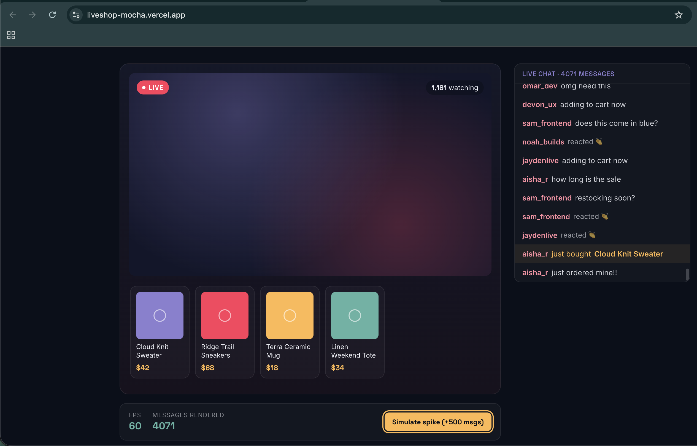

# LiveShop

A mini live-shopping stream UI — the kind of interface an SMB merchant would use to sell products during a live broadcast. Built to explore the specific front-end problems that come with real-time, high-frequency UIs: keeping a fast-scrolling chat smooth, throttling animation under load, and structuring components so a live product overlay can update without disrupting playback.

**[Live demo →](https://liveshop-mocha.vercel.app)**



## Why I built this

I wanted a project that went past "CRUD app with a nice UI" and actually forced me to think about performance under load — the kind of problem that shows up in real live-streaming products but rarely in tutorial projects. So instead of building something abstract, I simulated an actual live-shopping stream: chat messages, reactions, and purchases arriving continuously, with a product carousel merchants would use to feature items mid-broadcast.

**[Read the full technical writeup →](https://dev.to/shrutictc2/how-i-kept-a-live-chat-feed-smooth-at-3700-messages-1kf6)**

## The performance problem, concretely

A naive chat feed — `messages.map(m => <div>{m}</div>)` — works fine at 50 messages. It falls apart at a few hundred: every new message re-renders and repaints every row in the DOM, even the ones scrolled out of view. In a live stream, message volume spikes hard right after a product drop or a popular moment, which is exactly when you can't afford dropped frames.

**What I did about it:**
- The chat feed is virtualized with `react-window`, so only the ~12 rows actually visible in the viewport are mounted in the DOM at any time, regardless of whether the feed has 50 messages or 50,000.
- Reaction animations are capped at 8 concurrent bubbles — reactions can arrive multiple times a second, and animating every single one would spawn DOM nodes faster than the browser can clean them up.
- Chat history is capped at 5,000 messages client-side, so a long-running stream doesn't grow memory without bound.
- There's a **"Simulate spike" button** in the UI that fires 500 messages instantly, plus a live FPS readout, so the performance claim is something you can watch happen rather than take on faith.

**Before/after**, measured locally (Chrome, MacBook Air) after firing repeated spikes to ~3,300 messages:

| | Without virtualization (`.map()`) | With `react-window` |
|---|---|---|
| FPS during spike | dropped to **25** | steady **60** |
| Chat row elements in the DOM | **3,333** (one per message) | **14** (only the visible viewport) |

The FPS drop shows up under load; the DOM count difference is the more fundamental story — it holds *regardless* of how demanding the spike is, since react-window only ever mounts what's actually visible on screen.

To reproduce: temporarily swap `ChatFeed`'s `List` for a plain `.map()` render, hit "Simulate spike," and watch the FPS counter and browser devtools' performance tab.

## Architecture

```
src/
  lib/
    liveEventStream.js   # mock real-time event source (stand-in for a WebSocket)
  components/
    ChatFeed.jsx          # virtualized chat, react-window
    ProductCarousel.jsx   # scrollable product rail
    ReactionLayer.jsx     # throttled floating reaction animation
  App.jsx                 # wires the stream to the UI, tracks FPS
```

`liveEventStream.js` is intentionally isolated behind a simple callback interface (`onEvent`). In production this file is the only thing that would change — swap the `setInterval` mock for a real `WebSocket` connection, and every component downstream keeps working unchanged, since they only depend on the event shape, not the transport.

## Stack

- React + Vite
- [`react-window`](https://github.com/bvaughn/react-window) for list virtualization
- Plain CSS (no framework) — kept intentional control over the live-commerce visual direction (ink navy, coral, gold)

## Running locally

```bash
npm install
npm run dev
```

## What I'd add with more time

- Swap the mock event stream for a real WebSocket server (even a small Node one) to validate the architecture end-to-end
- Virtualize the product carousel for merchants with large catalogs
- Add automated performance regression tests (e.g. Playwright + performance trace assertions) instead of manual FPS-watching
